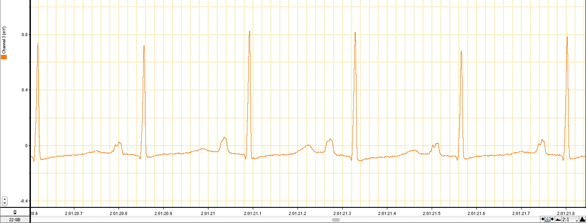
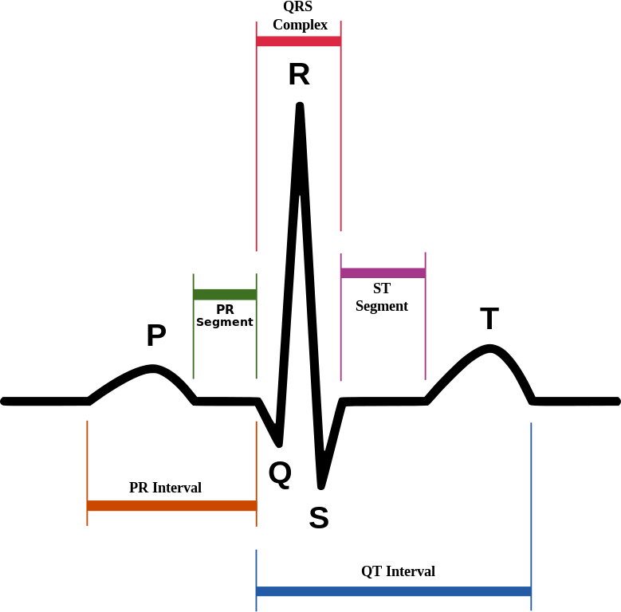
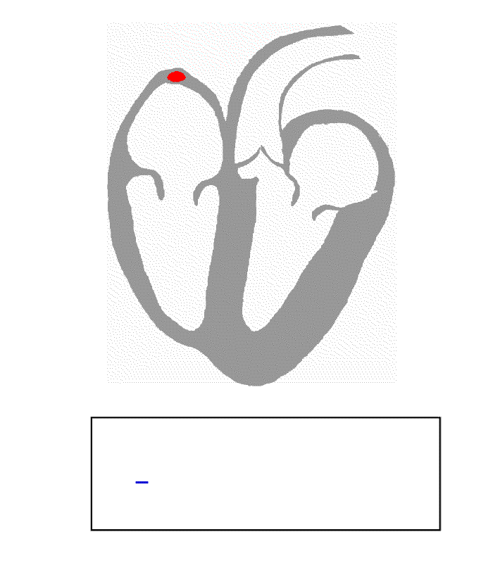

.. include:: <s5defs.txt>
.. include:: <isonum.txt>

==========================================
Python, Pharmaceuticals and Drug Discovery
==========================================

:Authors: Emlyn Clay
:Organization: OpenVivo Ltd.
:Contact: emlyn.clay@openvivo.com
:Date: 23rd February 2014 

.. footer:: OpenVivo Ltd, All rights reserved.
   
=========================
Pharmaceuticals in the UK
=========================

.. container:: compare-left
   
    .. class:: incremental
     
        + Annual trade surplus of ~£5 billion [#]_
        + Approximately 1/3 of the UK's R&D spend [#]_
        + Jobs are mostly scientific and engineering based.

.. container:: compare-right

    .. image:: images/pie_chart_pharmaceutical_jobs.gif
       :alt: pie chart of the distribution of pharmaceutical jobs
       :target: http://www.ons.gov.uk/ons/dcp171778_287868.pdf

==========
Objectives
==========

.. class:: incremental

   + Introduce preclinical-clinical drug discovery
   + Demonstrate computational aspects of preclinical-clinical problems
   + Make a case for Python and it's scientific stack

.. class:: "section"

==========================
Preclinical Drug Discovery
==========================

==============================
Preclinical testing focuses on
==============================

.. container:: compare-left

   .. class:: incremental

      + Testing the drug in cells and mammals
      + *Efficacy* - does the drug work
      + *Toxicity* - does the drug have *acceptable* adverse effects
      + "Dosis Sola Facit Venenum"
      + ... "Only the dose determines the poison"

.. container:: compare-right

   .. image:: images/wistar_rat.jpg
      :alt: A wistar rat
      :target: http://en.wikipedia.org/wiki/File:Wistar_rat.jpg
               

===================================
Pharmaceutical use cases for Python
===================================

.. class:: incremental

   + Processing and classification of biosignals; ECG, Blood Pressure
   + Statistical analysis of clinical datasets
   + Documentation according to regulated ontologies

.. class:: "section"

============
ECG analysis
============

==================
The case of RPL554
==================

.. container:: compare-left

   .. class:: incremental

   + RPL554, a novel PDE3/4 inhibitor
   + Demonstrated hERG blockade
   + Inwardly Rectifying Potassium Current (|iKr|)
   + Blockade of |iKr| prolongs Q-peak to T-peak interval of the ECG
   + Prolonged QTc can lead to Torsades de pointes

.. container:: compare-right

    .. image:: images/rpl554.png
       :alt: pie chart of the distribution of pharmaceutical jobs
       :target: http://www.ons.gov.uk/ons/dcp171778_287868.pdf

==========================
ECG, the ElectroCardioGram
==========================

============
A single ECG
============

=============================
The ECG and the cardiac cycle
=============================

================================
Analyzing the ECG: Read the data
================================

.. code-block:: python
 
    # imports
    import vrp, h5py as hdf, numpy as np, scipy as sp
    
    # read data in 
    data = hdf.File('ecg_2s.hdf5', 'r')
    ecg = data.get('gp_ecg')
    sampling = ecg.attrs.get('sampling_frequency')

    # smoothing

==================================
Analyzing the ECG: Find the R-peak
==================================

Scans the signal, when the threshold is met follow until we go under
the threshold, quadratically interpolate the peak width and the np.max
is the peak.

.. code-block:: python
    
    # parameters
    minheight = np.percentile(ecg, 0.9)
    minwidth = sampling * (1 / 0.0015) # R-peak is about 15ms
    
    # find R-peak using a translation of findpeak.m
    findpeaks = vrp.ecg.findpeaks
    peaks, locs = findpeaks(ecg, minheight, minwidth)
    beat = zip(peaks, locs)

=============================================
Analyzing the ECG: Find the Q-peak and T-peak
=============================================

.. container:: compare-left
   
  .. class:: incremental

    + With each beat, slice backward to find the local minima, Q-peak 
    + Slice forward, find the local maxima T-peak
    + Least Mean Square (LMS) regression from T-peak to T-end

.. container:: compare-right

   .. image:: images/ecg.png
      :alt: ECG
      :target: http://en.wikipedia.org/wiki/File:SinusRhythmLabels.svg   
      :width: 500px
   
================================================
Analyzing the ECG: Correct the QT for heart rate
================================================

.. container:: compare-left
   
  .. class:: incremental

    + QT increases curvilinearly with heart rate (HR) 
    + Traditional correction methods approximate to :math:`QTc = \frac{QT}{\sqrt[2]{RR}}`
    + Individual regression of HR for each trial is best 

.. container:: compare-right

   .. image:: images/qt_correction_factors.png
      :alt: QT correction factors
      :target: http://www.cardiovascular-sciences.org/wp-content/uploads/2013/07/6b.png  
      :width: 500px

=========================================
How does Python help you analyse the ECG?
=========================================

.. container:: compare-left

   .. class:: incremental

      + No more difficult than MATLAB
      + Most commercial ECG analysis tool have poor scripting
      + Poor end-to-end workflows
      + Breakout of domain specific tools

.. container:: compare-right

   .. image:: images/ecg.png
      :alt: ECG
      :target: http://en.wikipedia.org/wiki/File:SinusRhythmLabels.svg   
      :width: 500px

.. class:: section

=========================================
Statistical analysis of clinical datasets
=========================================

=================
Clinical datasets
=================

.. container:: compare-left

   .. class:: incremental

       + Larg-ish Set of Records; 200Mb Phase 1, 1Gb Phase 2,
       + Shape 8-20 cols by ~30,000 rows
       + Pivot on ~100 different axes and report 
       + abbr Evrywhr

.. container:: compare-right

   .. image:: images/clinical_dataset.png 
      :alt: Power pivot icon
      :target: http://www.veronapharma.com
      :width: 500px

==========================
Pivoting Clinical Datasets
==========================

.. container:: compare-left

   .. class:: incremental

       + Originally I rolled my own
           - Subclass recarray, 
           - Use np.unique,
           - "Stack" the data, a.k.a, build a tree
       + Now, I use Pandas

.. container:: compare-right

   .. image:: images/clinical_dataset.png
      :alt: Clinical dataset
      :target: http://www.veronapharma.com
      :width: 500px

==========================
Pivoting Clinical Datasets
==========================

.. code:: python

   import pandas as pd

   df = ... # import data from excel, sql

   # pivot the whole dataset
   results = pd.pivot_table(df, cols=['Parameter'], rows=['Subject', 'Activity'], values='Value')

   # group by, in stages
   by_subject = df.groupby('subject');

   for name, group in by_subject:
        # calculate parameter,
        # e.g. regression heart rate vs dose

============
abbr Evrywhr
============

.. container:: compare-left

   .. class:: incremental

       + Abbreviations a.k.a Clinical Ontologies
       + "Explicit is better than implicit."
       + Dictionary map our ontologies to theirs
       + __repr__ method to print description

.. container:: compare-right

   .. image:: images/abbreviations.jpg
      :alt: Image of abbreviations
      :target: http://www.full-proof.co.uk/Blog/wp-content/uploads/2012/03/44852_8e1ede809fe796b3baee1a58609e8583.jpg 
      :width: 500px

===============================================
How does Python help you analyse clinical data?
===============================================

.. container:: compare-left

   .. class:: incremental

        + Clinical datasets are a little too large for Excel
        + Full-fledged programming, REPL and easy syntax
        + Limits the sprawl of Excel spreadsheets
        + ``scikits.statsmodels`` integrates with pandas

.. container:: compare-right

   .. image:: images/clinical_dataset.png
      :alt: Image of abbreviations
      :target: http://www.veronapharma.com 
      
.. class:: section

===============================================
Documentation according to regulated ontologies
===============================================

==================================
Converting our documents to Sphinx
==================================

.. container:: compare-left

   .. class:: incremental

       + Convert Word to HTML
       + Clean HTML elements
       + Pandoc to ReST
       + Generate a TOC

.. container:: compare-right

   .. image:: images/sphinx_logo.png
      :alt: Sphinx Logo
      :target: http://www.import-this.de/media/cache/img/podcasts/import-this/episodes/sphinx_img_episode_lg.png

================
Sphinx: Rolename
================

.. container:: compare-left

   .. class:: incremental

       + Regulatory submissions must use the **Common Technical Document** format
       + Rolename per variable of the eCTD
       + Build process for submission 

.. container:: compare-right

   .. image:: images/CTD_triangle.gif
      :alt: CTD triangle
      :target: http://upload.wikimedia.org/wikipedia/commons/c/c2/CTD-img004.gif 

===========================
Sphinx: Features for Pharma
===========================

.. container:: compare-left

   .. class:: incremental

       + Convert to Latex > PDF, HTML
       + Searchable, hyperlinked.
       + Rolename to add in regulatory parameters
       + Directives to control repetitive macro content 
       
.. container:: compare-right

   .. image:: images/sphinx_logo.png
      :alt: Sphinx Logo
      :target: http://www.import-this.de/media/cache/img/podcasts/import-this/episodes/sphinx_img_episode_lg.png

.. class:: section

=============================================
What's holding Python back in Drug Discovery?
=============================================

===============================================
Inertia, regulation and having someone to blame
===============================================

.. container:: compare-left

   .. class:: incremental

       + Culturally slow to change
       + Use Office, Use Sharepoint
       + Regulated companies want regulated solutions
       + Liability and legal conformity 
       
.. container:: compare-right

   .. image:: images/friction_motion.gif
      :alt: Friction
      :target: http://www.stmary.ws/highschool/physics/home/notes/dynamics/friction/imgE2.gif 

==================
Possible solutions
==================

.. container:: compare-left

   .. class:: incremental

       + Social engineering
       + Target biotech then target Big Pharma
       + Python Certified®
       + A legal entity to insure the code - PSF? Continuum? 
       
.. container:: compare-right

   .. image:: images/solutions.jpg
      :alt: Solutions Icon
      :target: http://i-codedesign.com/wp-content/uploads/2012/04/solutionsicon.jpg

.. class:: section

==========
Questions?
==========

.. Replacements 
.. |umole| replace:: \ |micro|\ mole\
.. |iKr| replace:: I\ :sub:`Kr`

.. Footnotes
.. [#] HM Revenue and Customs, UK Trade Info 2012, February 2013
.. [#] ONS, Business Enterprise Research and Development 2010, November 2012
